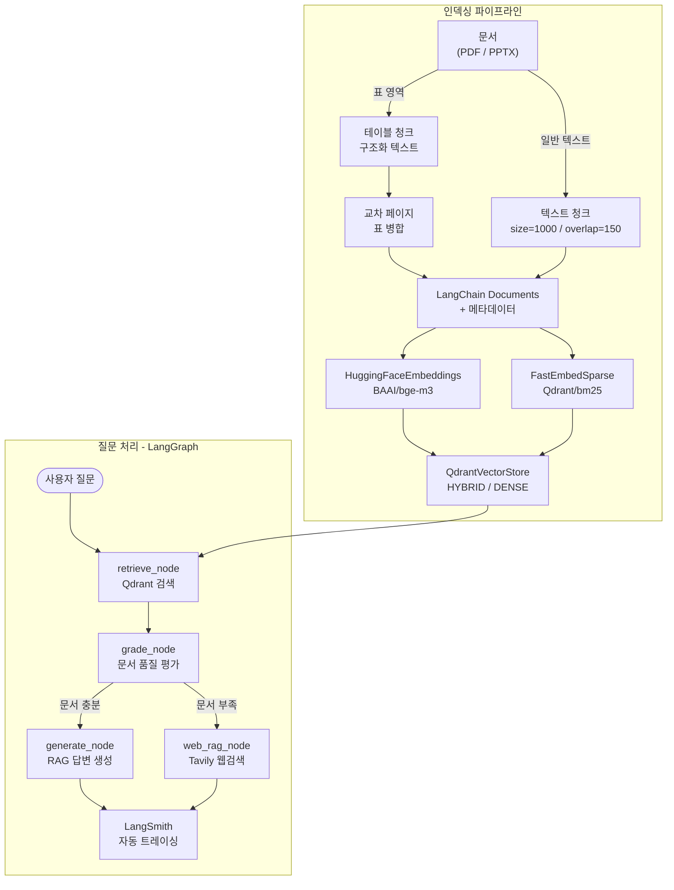
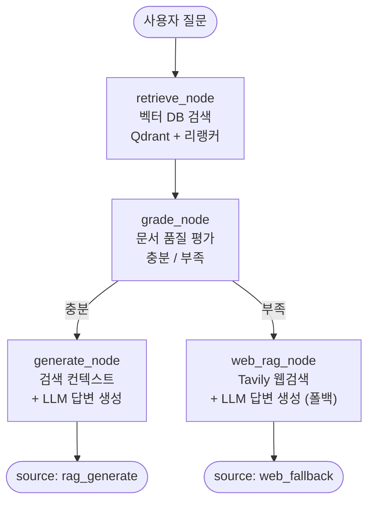

# Table RAG 기반 검색 Agent

문서 속 **테이블 구조**를 정확히 이해하는 RAG 시스템입니다.
기존 RAG는 문서를 단순 텍스트로 파싱하면서 표의 행/열 관계를 파괴합니다.
이 프로젝트는 테이블을 별도 청크로 구조화하고, LangGraph 기반으로 벡터 DB를 먼저 검색한 뒤 문서가 부족하면 웹 검색으로 폴백합니다.

**배포 주소**: [https://tablerag.streamlit.app/](https://tablerag.streamlit.app/)

---

## 목차

1. [프로젝트 개요](#1-프로젝트-개요)
2. [개발 여정](#2-개발-여정)
3. [시스템 아키텍처](#3-시스템-아키텍처)
4. [기술 스택](#4-기술-스택)
5. [핵심 구현](#5-핵심-구현)
6. [LangGraph 라우팅 에이전트](#6-langgraph-라우팅-에이전트)
7. [정확도 테스트 (Golden Dataset)](#7-정확도-테스트-golden-dataset)
8. [빠른 시작](#8-빠른-시작)
9. [코드 재사용 가이드](#9-코드-재사용-가이드)

---

## 1. 프로젝트 개요

### 왜 Table RAG인가?

일반적인 RAG 시스템은 문서를 좌→우, 위→아래로 읽어 단순 텍스트로 변환합니다.
표가 있는 문서에서는 이 과정에서 **행/열 관계가 파괴**되어 정보를 잘못 추출합니다.

**PDF 원본 표 (POSCO홀딩스 주식 소각 결정)**

```
┌─────────────────────────┬─────────────────┐
│ 항목                    │ 내용            │
├─────────────────────────┼─────────────────┤
│ 소각할 주식의 종류      │ 보통주식        │
│ 소각할 주식의 수 (주)   │ 1,691,425       │
│ 소각예정금액 (원)       │ 635,130,087,500 │
│ 이사회결의일            │ 2026-02-19      │
└─────────────────────────┴─────────────────┘
```

**❌ 기존 RAG — 벡터 DB에 저장되는 청크**

PDF를 좌→우, 위→아래 순서로 읽어 텍스트를 이어 붙입니다.
행/열 구분이 사라지고, "어떤 항목의 값인지" 맥락이 끊깁니다.

```
항목 내용 소각할 주식의 종류 보통주식 소각할 주식의 수 (주)
1,691,425 소각예정금액 (원) 635,130,087,500 이사회결의일 2026-02-19
```

→ LLM이 "소각예정금액은?"을 물으면 `1,691,425`와 `635,130,087,500` 중 어느 숫자가 답인지 혼동합니다.

**✅ Table RAG — 벡터 DB에 저장되는 청크**

표 영역을 인식한 뒤 `열이름=값` 구조로 직렬화합니다.
각 숫자가 어떤 항목에 속하는지 명확히 보존됩니다.

```
TABLE
title: 주식 소각 결정
columns: 항목, 내용
row1: 항목=소각할 주식의 종류 | 내용=보통주식
row2: 항목=소각할 주식의 수 (주) | 내용=1,691,425
row3: 항목=소각예정금액 (원) | 내용=635,130,087,500
row4: 항목=이사회결의일 | 내용=2026-02-19
```

→ LLM이 "소각예정금액은?"을 물으면 `row3`에서 `635,130,087,500`을 정확히 추출합니다.

### 핵심 아이디어 3가지

| # | 핵심 아이디어 | 문제 | 해결 방법 |
|---|--------------|------|-----------|
| 1 | **테이블 구조화 저장** | 기존 RAG는 표를 단순 텍스트로 변환해 행/열 관계가 파괴됨 | PDF는 선·배경색·텍스트 정렬 패턴으로 표 영역을 탐지, PPTX는 포맷에 내장된 표 구조를 직접 파싱 → 일반 텍스트와 분리 → `열이름=값` 형식으로 구조를 보존하여 별도 청크로 저장 |
| 2 | **셀 병합 테이블 인식** | 셀이 가로·세로로 병합된 표는 단순 텍스트로 변환하면 값이 잘못된 열에 매핑되거나 누락됨 | 병합 셀을 확장해 각 셀이 속하는 열을 복원한 뒤 `열이름=값` 형식으로 직렬화 |
| 3 | **연속 페이지 테이블 병합** | 표가 페이지 경계에서 잘리면 앞·뒤 청크가 분리되어 전체 맥락 손실 | 연속 페이지 간 열 수·위치·반복 헤더를 감지해 하나의 청크로 병합 |

---

## 2. 개발 여정

git 커밋 이력 기반 단계별 진화 과정입니다.

| 단계 | 커밋 | 내용 | 핵심 기술 |
|------|------|------|-----------|
| 1 | `933fb64` | 초기 RAG 구축 | Qdrant Cloud + BAAI/bge-m3 임베딩 |
| 2 | `9044b9c` | 테이블 영역 분리 | 표 감지 + 구조화 텍스트(`열이름=값`) 변환 |
| 3 | `99b881a` | LLM 연결 | gpt-4o-mini |
| 4 | `f654561` | 리랭커 추가 | BAAI/bge-reranker-v2-m3, top-20 → top-5 정밀 선별 |
| 5 | `3e948c5` | 하이브리드 검색 | 의미기반(bge-m3 dense) + 키워드기반(BM25 sparse), RRF 융합 |
| 6 | — | 복잡한 셀 병합 테이블 인식 | colspan/rowspan 자동 감지, N단 헤더 병합 |
| 7 | `e1c5060` | 교차 페이지 표 병합 | 연속 페이지 휴리스틱, 반복 헤더 제거 |
| 8 | `c32c34e` | LangChain/LangSmith 전환 | LCEL 체인, 자동 트레이싱 |
| 9 | `0651e7d` | LangGraph 에이전트 도입 | 벡터 DB 우선 검색 → 문서 부족 시 Tavily 웹검색 폴백 |
| 10 | `8744eb6` | Streamlit Cloud 배포 | 멀티 문서 업로드, 채팅 UI |

---

## 3. 시스템 아키텍처

### 전체 흐름



### 라우팅 결과 레이블 (Streamlit UI)

| source 값 | UI 표시 | 설명 |
|-----------|---------|------|
| `rag_generate` | 📄 RAG 검색 (벡터 DB) | Qdrant 검색 후 문서 기반 답변 |
| `web_fallback` | 🌐 웹 검색 (문서 부족 시 폴백) | Qdrant 검색했으나 관련 문서 없음 → Tavily |

---

## 4. 기술 스택

| 구성 요소 | 기술 | 설명 |
|-----------|------|------|
| 에이전트 프레임워크 | LangGraph | StateGraph 기반 조건부 라우팅 |
| 프레임워크 | LangChain | LCEL 체인, 리트리버, 리랭커 통합 |
| Vector Store | Qdrant Cloud | 고성능 벡터 검색, 하이브리드(dense+sparse) 지원 |
| 벡터 검색 임베딩 | BAAI/bge-m3 | HuggingFaceEmbeddings, cosine 정규화 |
| 키워드 검색 임베딩 | Qdrant/bm25 | FastEmbedSparse (fastembed), 하이브리드 검색용 |
| Reranker | BAAI/bge-reranker-v2-m3 | CrossEncoderReranker, top-20 → top-5 |
| LLM | gpt-4o-mini | ChatOpenAI (temperature=0) |
| 웹검색 | Tavily | 실시간 웹검색, 최대 5개 결과 |
| PDF 파싱 | PyMuPDF (fitz) | 텍스트 + 테이블 구조화 추출 |
| PPTX/PPT 파싱 | python-pptx | 슬라이드 텍스트 + 표 도형 구조화 추출 |
| UI | Streamlit | 멀티 문서 업로드 (PDF/PPTX/PPT), 채팅 인터페이스 |
| 관찰성 | LangSmith | `LANGSMITH_TRACING=true` 설정 시 자동 트레이싱 |

---

## 5. 핵심 구현

### 5.1 테이블 구조화 저장

문서에서 테이블을 LLM이 이해하기 좋은 텍스트로 변환합니다.

**Step 1 — 테이블 영역 감지**

- **PDF** (PyMuPDF): 선(line), 배경색, 텍스트 정렬 패턴을 분석해 테이블 영역을 일반 텍스트와 분리합니다. 감지된 테이블마다 bbox 좌표를 기록해 이후 교차 페이지 병합 판단에도 활용합니다.
- **PPTX/PPT** (python-pptx): 슬라이드의 도형(shape) 중 `has_table`이 참인 도형을 표로 직접 식별합니다. 시각적 패턴 분석 없이 파일 구조에서 바로 추출합니다.

**Step 2 — 제목 감지** (휴리스틱)

- **PDF**: 테이블 상단에서 가장 가까운 텍스트 블록(120자 이하)을 캡션으로 추출합니다.
- **PPTX/PPT**: 슬라이드 제목 도형(title placeholder)을 캡션으로 사용합니다.

**Step 3 — 구조화 텍스트 변환** (공통)

첫 행을 헤더(열 이름)로 고정하고, 각 데이터 행을 `열이름=값` 쌍으로 직렬화합니다.

```
TABLE
title: 주식 소각 결정
columns: 항목, 내용
row1: 항목=소각할 주식의 종류 | 내용=보통주식
row2: 항목=소각할 주식의 수 (주) | 내용=1,691,425
row3: 항목=소각예정금액 (원) | 내용=635,130,087,500
```

---

### 5.2 복잡한 셀 병합 테이블 인식

rowspan·colspan이 섞인 표는 단순 텍스트 파싱으로는 셀 값이 잘못된 열에 매핑됩니다.
병합 셀을 확장해 모든 행의 열 수를 균일하게 맞춘 뒤, 빈 셀(병합 잔여 셀)은 건너뛰어 노이즈를 제거합니다.

#### 가로 병합 (colspan) — 헤더가 여러 열을 묶는 경우

```
PDF 원본:
┌──────────┬───────────────────────┐
│          │     매출 (백만원)     │  ← colspan=3 (가로 병합)
│  부문    ├────────┬──────┬───────┤
│          │  국내  │ 해외 │ 합계  │
├──────────┼────────┼──────┼───────┤
│ 반도체   │ 80,000 │132,000│212,000│
└──────────┴────────┴──────┴───────┘

단순 파싱 결과 (❌):
"부문 매출 (백만원) 국내 해외 합계 반도체 80,000 132,000 212,000"
→ "매출"이 어느 열의 헤더인지, 숫자가 국내/해외/합계 중 어느 값인지 알 수 없음

병합 셀 확장 후 직렬화 (✅):
columns: 부문, 매출_국내, 매출_해외, 매출_합계
row1: 부문=반도체 | 매출_국내=80,000 | 매출_해외=132,000 | 매출_합계=212,000
```

#### 세로 병합 (rowspan) — 하나의 셀이 여러 행을 묶는 경우

```
PDF 원본:
┌──────────┬──────┬────────┐
│  계열    │ 제품 │ 달성률 │  ← 헤더 행
├──────────┼──────┼────────┤
│          │ A-1  │  120   │  ← "A계열" 셀이 2행을 병합 (rowspan=2)
│  A계열   ├──────┼────────┤
│          │ A-2  │  110   │
├──────────┼──────┼────────┤
│          │ B-1  │   95   │  ← "B계열" 셀이 2행을 병합 (rowspan=2)
│  B계열   ├──────┼────────┤
│          │ B-2  │   88   │
└──────────┴──────┴────────┘

단순 파싱 결과 (❌):
"계열 제품 달성률 A계열 A-1 120 A-2 110 B계열 B-1 95 B-2 88"
→ A-2·B-1·B-2가 어느 계열에 속하는지 연결 끊김

병합 셀 확장 후 직렬화 (✅):
columns: 계열, 제품, 달성률
row1: 계열=A계열 | 제품=A-1 | 달성률=120
row2: 계열=A계열 | 제품=A-2 | 달성률=110   ← 병합 셀 "A계열"이 각 행에 채워짐
row3: 계열=B계열 | 제품=B-1 | 달성률=95
row4: 계열=B계열 | 제품=B-2 | 달성률=88
```

---

### 5.3 연속 페이지 테이블 병합

표가 페이지 경계에서 잘리는 경우, 다음 **5가지 조건을 모두 만족**할 때 두 테이블을 하나의 청크로 병합합니다.

```
[ 1페이지 ]                    [ 2페이지 ]
┌──────┬──────┬──────┐        ┌──────┬──────┬──────┐
│ 항목 │ 2024 │ 2025 │        │ 항목 │ 2024 │ 2025 │  ← 반복 헤더 (자동 제거)
├──────┼──────┼──────┤        ├──────┼──────┼──────┤
│  A   │  100 │  120 │   +    │  C   │  300 │  350 │
│  B   │  200 │  230 │        │  D   │  400 │  460 │
└──────┴──────┴──────┘        └──────┴──────┴──────┘
     페이지 하단 30% 이내             페이지 상단 72% 이내
             └──────────────────────────┘
                        병합 조건 충족 → 단일 청크
```

| 조건 | 판별 방법 |
|------|-----------|
| 연속 페이지 | 다음 표의 페이지 = 현재 표 마지막 페이지 + 1 |
| 이전 페이지 마지막 표 | 같은 페이지에 뒤따르는 표가 없음 |
| 다음 페이지 첫 번째 표 | 같은 페이지에 앞서는 표가 없음 |
| 열 수 동일 | 두 표의 첫 행 열 개수가 일치 |
| 위치 휴리스틱 | 이전 표 끝 위치 ≥ 페이지 높이의 30% AND 다음 표 시작 위치 ≤ 페이지 높이의 72% |

> **위치 휴리스틱이란?**
> "이전 페이지의 표가 페이지 하단 근처에서 끝나고, 다음 페이지의 표가 페이지 상단 근처에서 시작하면 같은 표가 페이지를 넘어 이어진 것으로 본다"는 규칙입니다.
>
> 정확한 수치 의미:
> - **이전 표 끝 위치 ≥ 30%** → 표가 페이지 위쪽 30% 안에서만 끝나면 잘린 게 아니라 그냥 짧은 표일 가능성이 높으므로 제외
> - **다음 표 시작 위치 ≤ 72%** → 다음 페이지에서 표가 페이지 중간 이하(72% 아래)에서 시작하면 앞 페이지와 무관한 새 표일 가능성이 높으므로 제외
>
> "휴리스틱(Heuristic)"은 완벽한 공식은 없지만 경험적으로 잘 맞는 규칙이라는 의미입니다. 30%·72% 수치는 실제 PDF 레이아웃에서 반복 테스트를 통해 결정한 임계값입니다.

반복 헤더 제거: 다음 페이지 첫 행이 헤더와 동일하면 자동으로 제거합니다.

---

### 5.4 하이브리드 검색

벡터 검색(의미 기반)과 BM25 키워드 검색을 **RRF(Reciprocal Rank Fusion)**로 결합합니다.

| 방식 | 강점 |
|------|------|
| Dense (bge-m3) | 의미 유사도 기반, 표현이 다른 질문도 검색 가능 |
| Sparse (BM25) | 키워드 정확 일치, 고유명사·수치에 강함 |

**RRF란?**

두 검색 결과를 점수가 아닌 **순위(rank)**로 합치는 방법입니다.
각 시스템에서 문서의 순위를 역수로 변환해 더하기 때문에, 두 시스템 모두 상위에 올린 문서일수록 최종 점수가 높아집니다.

```
RRF 점수 = 1/(k + dense_rank) + 1/(k + sparse_rank)   (k=60, 상수)

예시:
  문서 A: dense 1위, sparse 3위 → 1/61 + 1/63 = 0.0321
  문서 B: dense 5위, sparse 1위 → 1/65 + 1/61 = 0.0318
  문서 C: dense 2위, sparse 2위 → 1/62 + 1/62 = 0.0323  ← 둘 다 상위권이라 최고점
```

두 방식 중 하나에서만 상위권이어도 반영되고, 두 방식 모두 상위권이면 가장 높은 점수를 얻습니다.

---

### 5.5 리랭커

하이브리드 검색으로 뽑은 **top-20 청크를 top-5로 정밀 선별**합니다.

**왜 리랭커가 더 정확한가?**

| 방식 | 동작 | 특징 |
|------|------|------|
| 벡터 검색 (bi-encoder) | 질문과 문서를 **따로** 임베딩 → 벡터 유사도 계산 | 빠르지만 질문-문서 관계를 직접 보지 않음 |
| 리랭커 (cross-encoder) | 질문과 문서를 **함께** 입력 → 관련도 점수 출력 | 느리지만 두 텍스트의 관계를 직접 판단 |

```
[벡터 검색]  질문 → 벡터A        [리랭커]  (질문 + 문서) → 관련도 점수
             문서 → 벡터B                   질문과 문서를 함께 읽고
             cos(A, B) = 유사도             "이 문서가 이 질문의 답인가?"를 직접 판단
```

벡터 검색은 속도를 위해 질문과 문서를 독립적으로 인코딩하기 때문에 세밀한 문맥 판단이 어렵습니다.
리랭커는 범위를 top-20으로 좁힌 뒤 질문+문서를 함께 읽어 정확도를 높입니다.

---

### 5.6 청크 ID 및 Qdrant 저장 구조

**청크 ID 규칙**

```
텍스트 청크:  {doc_slug}::p{page:04d}_t{j:03d}
테이블 청크:  {doc_slug}::p{page:04d}_tb{k:03d}

예시)
  posco_report::p0002_t001   ← 2페이지 첫 번째 텍스트 청크
  posco_report::p0003_tb001  ← 3페이지 첫 번째 테이블 청크
```

**Qdrant에 실제 저장되는 포인트 구조**

Qdrant Cloud 콘솔에서 보면 각 포인트는 다음과 같은 형태로 저장됩니다.

```json
{
  "id": "550e8400-e29b-41d4-a716-446655440000",
  "vector": {
    "dense":  [0.021, -0.183, 0.047, ...],   // bge-m3 임베딩 (1024차원)
    "sparse": {"indices": [102, 487, ...], "values": [0.43, 0.21, ...]}  // BM25 (하이브리드 시)
  },
  "payload": {
    "page_content": "TABLE\ntitle: 주식 소각 결정\ncolumns: 항목, 내용\nrow1: 항목=소각할 주식의 종류 | 내용=보통주식\nrow2: 항목=소각예정금액 (원) | 내용=635,130,087,500",
    "metadata": {
      "doc":         "POSCO홀딩스_주식 소각 결정.pdf",
      "page":        1,
      "chunk_id":    "posco_holding::p0001_tb001",
      "source_type": "table"
    }
  }
}
```

| 필드 | 설명 |
|------|------|
| `vector.dense` | bge-m3로 임베딩한 벡터 (의미 검색에 사용) |
| `vector.sparse` | BM25 희소 벡터 (키워드 검색에 사용, 하이브리드 모드 시만 존재) |
| `payload.page_content` | 실제 청크 텍스트 (LLM에 컨텍스트로 전달되는 내용) |
| `payload.metadata.doc` | 원본 문서 파일명 |
| `payload.metadata.page` | 페이지 번호 |
| `payload.metadata.chunk_id` | 청크 고유 ID (중복 업서트 방지용) |
| `payload.metadata.source_type` | 청크 유형 (`text` / `table`) |

---

## 6. LangGraph 라우팅 에이전트

### 6.1 도입 배경

기존 시스템은 모든 질문에 벡터 DB 검색만 수행했습니다. 문서에 없는 정보를 물어보면 답변을 생성하지 못하는 한계가 있었습니다. 이를 해결하기 위해 LangGraph로 두 단계 흐름을 구성합니다.

| 경로 | 조건 | 처리 방식 |
|------|------|-----------|
| 문서 RAG | 항상 먼저 시도 | Qdrant 검색 → 문서 품질 평가 → LLM 답변 |
| 웹 폴백 | 검색 문서가 부족할 때 | Tavily 웹검색 → LLM 답변 |

### 6.2 그래프 구조



**조건부 엣지 요약**

```
START → retrieve_node → grade_node
                            ├─ "sufficient"   → generate_node → END
                            └─ "insufficient" → web_rag_node  → END
```

### 6.3 노드별 설명

#### `retrieve_node` — 벡터 DB 검색

Qdrant에서 검색 후 리랭커로 top-20 → top-5 정밀 선별합니다. 하이브리드 토글이 켜져 있으면 벡터+키워드 검색, 꺼져 있으면 벡터 검색만 수행합니다.

#### `grade_node` — 문서 품질 평가

검색된 문서 상위 3개의 앞 300자를 발췌해 LLM이 질문과의 관련성을 평가합니다. 문서가 0개이면 즉시 `"insufficient"` 처리.

> **왜 300자인가?** 명확한 근거가 있는 수치는 아니고, 토큰 비용과 판단 정확도 간의 트레이드오프로 잡은 휴리스틱입니다.
> 300자 미만이면 맥락이 짧아 판단이 어렵고, 청크 전체를 보내면 grade 판단만을 위해 불필요한 비용이 발생합니다.
> 상위 3개 × 300자 = 약 900자면 "관련 있는 문서인가"를 판단하기에 충분합니다.

#### `generate_node` — RAG 기반 답변

검색된 문서를 컨텍스트로 LLM에 전달합니다. "제공된 컨텍스트 범위 안에서만 답하고, 근거가 부족하면 모른다고 하라" 프롬프트를 사용하며, 답변에 근거 청크 번호(`[1]`, `[2]`…)를 표시합니다.

#### `web_rag_node` — Tavily 웹검색 + LLM (폴백)

`grade_node`에서 문서 부족 판정 시 진입합니다. Tavily API로 최대 5개 결과 수집 → URL + 내용 조합 → LLM 답변 + 참고 URL 표시.

---

## 7. 정확도 테스트 (Golden Dataset)

테이블 RAG의 핵심 능력을 검증하는 39개 질문 세트입니다.

### A. 공시 데이터 정밀 추출
> 문서: `POSCO홀딩스_주식 소각 결정_(2026.02.19).pdf`

| ID | 질문 | 정답 |
|----|------|------|
| Q1 | 소각하기로 결정한 보통주식 총 수량은? | **1,691,425주** |
| Q2 | 소각예정금액은 총 얼마인가? | **635,130,087,500원** |
| Q3 | 이사회결의일은 언제인가? | **2026-02-19** |
| Q4 | 발행주식 총수 대비 소각 비율은? (소수점 둘째 자리) | **약 2.09%** |
| Q5 | 1주당 소각 평균 단가는? | **약 375,500원** |
| Q6 | 소각 재원은? | **배당가능이익 범위 내 자기주식** |
| Q7 | 주식 소각 이후 자본금 감소가 발생하는가? | **아니오** |
| Q8 | "기타 투자판단 중요사항" 항목별 요약 | **재원·법적근거·수량·금액 등 요약** |

### B. 병합 테이블 구조 해석
> 문서: `병합된 테이블 테스트 샘플.pdf`
> **테스트 포인트**: rowspan/colspan 병합 셀 해석, 증감률 비교

| ID | 질문 | 정답 |
|----|------|------|
| Q9 | 에너지 솔루션 부문의 2026년 영업이익은? | **124,000** |
| Q10 | 지능형 로보틱스 부문의 비고란 내용은? | **물류 자동화 로봇 수주 증가 및 R&D 비용 효율화** |
| Q11 | 전사 합계 매출 성장률에 가장 높게 기여한 사업부문은? | **지능형 로보틱스 (+97.8%)** |
| Q12 | 에너지 솔루션의 2025→2026 매출 증감액은? | **330,000** |

### C. 페이지 초월 및 데이터 정정
> 문서: `POSCO홀딩스_주주총회소집결의_(2026.02.19).pdf`
> **테스트 포인트**: 페이지 경계에서 분절된 표, 정정 공시 구분

| ID | 질문 | 정답 |
|----|------|------|
| Q13 | 김주연 사외이사 후보의 P&G 한국/일본지역 부회장 재임 기간은? | **2019~2022년** |
| Q13-1 | 김주연씨의 P&G 한국 대표이사 사장 재임 기간은? | **2016~2018년** |
| Q14 | 정정 공시 제2-2호 의안의 '정정 후' 내용은? | **분리선출 감사위원 수 증원** |
| Q15 | 김준기 후보가 포스코홀딩스 사외이사로 재직하기 시작한 연도는? | **2023년** |
| Q16 | 이주태 후보의 임기 및 신규/재선임 여부는? | **임기 1년, 재선임** |

### D. 다중 컬럼 헤더 · 수식 헤더 · 합계 행
> 문서: `[POSCO홀딩스]임원ㆍ주요주주특정증권등소유상황보고서(2026.03.10).pdf`
> **테스트 포인트**: A~H 8개 컬럼 레이블 매핑, 수식 포함 헤더 셀, 시점별 행 비교

| ID | 질문 | 정답 |
|----|------|------|
| Q17 | 이익참가부사채권에 해당하는 컬럼 알파벳은? | **E** |
| Q18 | 전환사채권(C), 신주인수권부사채권(D), 이익참가부사채권(E) 소유 수량은? | **모두 '-'** |
| Q19 | 직전보고서 대비 이번보고서 기준 증가한 주권 수량은? | **31주** (335 → 366) |
| Q20 | '특정증권등의 소유비율' 계산식 전체는? | **[A+I / J+I-(F+G+H)] × 100** |
| Q21 | 2026.01.30 장내매수와 2026.03.05 장내매수의 취득단가는? | **378,000원 / 374,500원** |
| Q22 | 세부변동내역 합계 행의 변동전·증감·변동후 주식 수는? | **335주 / 31주 / 366주** |
| Q23 | 세부변동내역 합계 행의 평균 취득단가는? | **376,419원** |
| Q24 | H열의 증권 종류명과 소유 수량은? | **기타, '-'** |

### E. 2단 열 헤더 (Multi-level Column Headers)
> 문서: `복잡한_테이블_테스트_샘플.pdf`
> **테스트 포인트**: 상위 헤더(매출/비용/이익)와 하위 헤더(국내/해외/합계)의 2단 계층 매핑

| ID | 질문 | 정답 |
|----|------|------|
| Q25 | '반도체' 부문의 '해외 매출'은? (단위: 백만원) | **132,000** |
| Q26 | '소재' 부문의 '비용 합계'는? (단위: 백만원) | **46,000** |
| Q27 | 세 부문 중 '순이익'이 가장 높은 부문은? | **반도체 (71,200백만원)** |
| Q28 | '디스플레이' 부문의 영업이익률은? | **약 36.1%** (34,500 ÷ 95,500) |

### F. 행/열 병합 혼재 (Mixed Rowspan + Colspan)
> 문서: `복잡한_테이블_테스트_샘플.pdf`
> **테스트 포인트**: 제품군 rowspan 2 + 분기 헤더 colspan 3 + 합계 행 colspan 2 동시 존재

| ID | 질문 | 정답 |
|----|------|------|
| Q29 | 'A-2' 제품의 2분기 달성률은? | **110.0%** |
| Q30 | 'B계열' 전체(B-1 + B-2)의 1분기 실적 합계는? | **350** (200 + 150) |
| Q31 | 1·2분기 통틀어 달성률이 가장 높은 제품과 수치는? | **A-1, 1분기 120.0%** |

### G. 카테고리 행 + 소계 테이블 (Category Rows + Subtotals)
> 문서: `복잡한_테이블_테스트_샘플.pdf`
> **테스트 포인트**: 【직접비】·【간접비】 카테고리 행(그룹 구분자) + 소계 행 + 총합 행 3단 계층

| ID | 질문 | 정답 |
|----|------|------|
| Q32 | '직접비' 소계는? (단위: 백만원) | **51,400** |
| Q33 | '간접비' 중 금액이 가장 큰 항목은? | **판관비 (41,500백만원)** |
| Q34 | '외주비'가 총 비용에서 차지하는 비중은? | **5.6%** |
| Q35 | 직접비와 간접비를 합산한 총 합계는? (단위: 백만원) | **156,000** |

### H. 양방향 헤더 매트릭스 (Bidirectional Header Matrix)
> 문서: `복잡한_테이블_테스트_샘플.pdf`
> **테스트 포인트**: 행 헤더(지역)와 열 헤더(제품)가 모두 존재하는 크로스탭, 합계 행/열 위치 파악

| ID | 질문 | 정답 |
|----|------|------|
| Q36 | '부산' 지역에서 'B제품'의 판매량은? | **1,200** |
| Q37 | '서울' 지역의 전 제품 판매량 합계는? | **4,690** |
| Q38 | 'C제품' 판매량이 가장 많은 지역과 판매량은? | **서울, 2,100개** |
| Q39 | 네 제품 중 전국 판매량 합계가 가장 많은 제품은? | **C제품 (4,350개)** |

---

## 8. 빠른 시작

### 준비물

- **문서 파일**: `테스트문서/` 폴더에 **PDF / PPTX / PPT** 넣기 (또는 Streamlit UI에서 업로드)
- **Qdrant Cloud**: Cluster URL / API Key ([cloud.qdrant.io](https://cloud.qdrant.io))
- **OpenAI API Key**
- **Tavily API Key**: [app.tavily.com](https://app.tavily.com)

---

### 최종 디렉토리 구조

```
root/
│
├── table_rag/                    ← pip-installable Python 패키지
│   │
│   ├── __init__.py               ← 최상위 공개 API 일괄 re-export
│   ├── config.py                 ← 전역 상수 (기본 모델명, 청크 크기 등)
│   ├── models.py                 ← Chunk dataclass + 싱글턴 모델 팩토리
│   │                                 (get_qdrant_client, load_embed_model,
│   │                                  load_reranker, get_llm …)
│   ├── indexing.py               ← Qdrant 인제스트
│   │                                 (ingest_pdfs_to_qdrant,
│   │                                  upsert_document_to_qdrant)
│   ├── retrieval.py              ← 하이브리드 검색 + 리랭킹
│   │                                 (search_and_rerank)
│   ├── qa.py                     ← LLM 답변 생성
│   │                                 (answer_with_openai,
│   │                                  build_context_from_docs)
│   ├── __main__.py               ← CLI 진입점 (python -m table_rag)
│   │
│   ├── table/                    ← ★ 핵심 재활용 서브패키지 ★
│   │   │                            RAG·Qdrant 의존성 없음
│   │   │                            pymupdf 하나만 있으면 독립 사용 가능
│   │   ├── __init__.py           ← 모든 공개 함수 re-export
│   │   ├── normalizer.py         ← 셀 정규화 / colspan·rowspan 처리 /
│   │   │                            N단 헤더 병합
│   │   ├── extractor.py          ← PyMuPDF 기반 PDF 테이블 추출
│   │   │                            (extract_raw_tables_from_doc,
│   │   │                             find_table_title)
│   │   ├── merger.py             ← 5가지 조건 기반 교차 페이지 병합
│   │   │                            (merge_cross_page_raw_tables)
│   │   └── serializer.py         ← 직렬화
│   │                                 table_to_text()  → LLM/임베딩용 텍스트
│   │                                 normalize_table() → (header, body) 튜플
│   │
│   └── document/                 ← 문서 → Chunk 변환 레이어
│       ├── __init__.py           ← load_document_chunks() 단일 진입점
│       │                            (확장자에 따라 PDF/PPTX 로더 자동 선택)
│       ├── pdf_loader.py         ← PDF → List[Chunk]
│       │                            (load_pdf_chunks, chunk_text,
│       │                             sanitize_doc_stem, assign_doc_slugs)
│       └── pptx_loader.py        ← PPTX/PPT → List[Chunk]
│                                    (load_pptx_chunks)
│
├── app/                          ← 애플리케이션 레이어 (재사용 불필요)
│   ├── rag_agent.py              ← LangGraph 워크플로우
│   │                                 retrieve → grade → generate / web_fallback
│   └── streamlit_app.py          ← Streamlit 채팅 UI
│
├── tools/                        ← 독립 실행 도구
│   └── pdf_to_pptx.py            ← PDF → PPTX 변환기
│                                    (table_rag.table 사용, Qdrant 무관)
│
├── pyproject.toml                ← 패키지 빌드 설정 / pip install 지원
├── requirements.txt              ← 전체 의존성 목록
├── .env.example                  ← 환경변수 템플릿
└── README.md
```


---

### 설치

```bash
# Python 3.11 권장
python -m venv .venv
.venv\Scripts\activate       # Windows
# source .venv/bin/activate  # macOS/Linux

pip install -r requirements.txt

# 개발 모드로 패키지 설치 (어디서든 import table_rag 가능)
pip install -e ".[all]"   # Windows PowerShell은 따옴표 필요
```

### 환경변수 설정

`.env.example`을 `.env`로 복사한 뒤 값을 채웁니다.

### 실행

```bash
# Streamlit UI
streamlit run app/streamlit_app.py

# CLI (인터랙티브 Q&A 루프)
python -m table_rag
# 또는 pip install -e . 후 콘솔 스크립트로도 실행 가능
table-rag

# PDF → PPTX 변환 도구
python tools/pdf_to_pptx.py
```

### Streamlit Cloud 배포 시 Secrets 설정

Streamlit Cloud → 앱 설정 → **Secrets** 탭에 `.env` 내용을 추가합니다.
`PDF_FOLDER`는 기본값이 `테스트문서`로 설정돼 있으므로, GitHub 저장소에 해당 폴더가 있으면 별도 설정 없이 자동 인식됩니다.

### 동작 흐름

1. 사이드바에서 문서(PDF/PPTX/PPT) 선택 또는 업로드
2. **인덱싱(전체 재구성) 실행** 또는 **업로드 파일 추가 인덱싱** 클릭
3. 채팅창에 질문 입력
4. LangGraph가 자동 처리:
   - 모든 질문 → Qdrant 벡터 검색 → 문서 품질 평가
     - **문서 충분** → RAG 답변
     - **문서 부족** → Tavily 웹검색 → Web RAG 폴백 답변
5. 답변 하단에 경로 표시: `📄 RAG 검색 (벡터 DB)` / `🌐 웹 검색 (문서 부족 시 폴백)`
6. `근거 청크 보기` 접기 패널에서 검색된 청크의 doc, page, chunk_id, type, 점수 확인 가능

---

## 9. 코드 재사용 가이드

핵심 흐름은 하나입니다: **문서 로드 → RAG 처리 → Qdrant 저장**

```python
from dotenv import load_dotenv
from table_rag import ingest_pdfs_to_qdrant

load_dotenv()  # QDRANT_URL, QDRANT_API_KEY, OPENAI_API_KEY

ingest_pdfs_to_qdrant(
    pdf_paths=["보고서.pdf", "계약서.pdf", "발표자료.pptx"],  # PDF / PPTX / PPT 모두 가능
    collection="my_collection",
    extract_table_chunks=True,       # 표를 구조화 텍스트로 분리 저장
    merge_cross_page_tables=True,    # 페이지 경계에서 잘린 표 자동 병합
    enable_hybrid=True,              # BM25 + 벡터 하이브리드 인덱싱
)
```

내부에서 일어나는 일:

```
문서 (PDF / PPTX)
    ├─ 표 영역 감지 및 셀 병합 처리
    │       └─ 교차 페이지 표 병합
    │               └─ "TABLE\nrow1: 항목=... | 내용=..." 구조화 텍스트
    └─ 일반 텍스트 → 슬라이딩 윈도우 청크 (size=1000 / overlap=150)
            └─ BGE-M3 임베딩 (dense) + BM25 (sparse)
                    └─ Qdrant에 저장
```

### 문서 한 건만 추가할 때 (컬렉션 유지)

전체 재인덱싱 없이 문서 하나만 추가하거나 교체할 때 사용합니다.

```python
from table_rag import upsert_document_to_qdrant

upsert_document_to_qdrant(
    doc_path="새로운_보고서_2026Q1.pdf",
    collection="my_collection",
)
```
