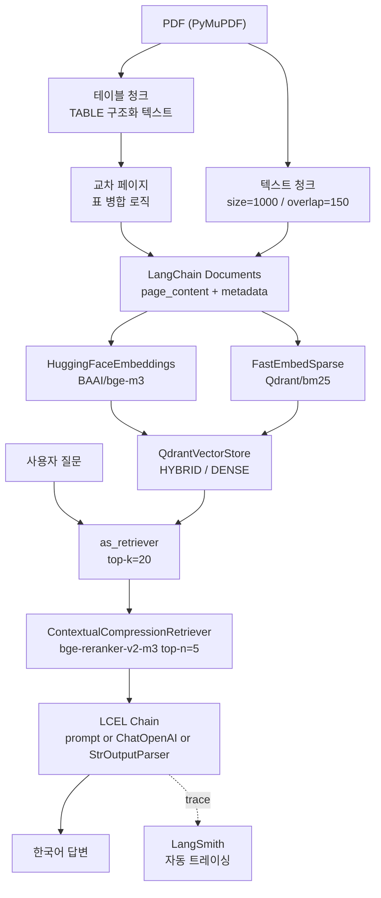

# 문서 QA 정확도 테스트 및 개선 가이드

---

## 1. 개발 진행 현황

| 단계 | 내용 | 완료일 |
|------|------|--------|
| 1 | RAG 구축 | '26.03.26 |
| 2 | 테이블 영역과 비테이블 영역 구분 | '26.03.27 |
| 3 | LLM 연결 | '26.03.30 |
| 4 | 하이브리드 서치 추가 | '26.04.01 |
| 5 | 연속 페이지 표 병합 로직 추가 | '26.04.01 |
| 6 | LangChain 기반으로 전환 (LangSmith 트레이싱 포함) | '26.04.02 |
| 7 | **테이블 인식 못하는 경우 찾아서 개선** | 진행 중 |

---

## 2. 기술 스택

### 2.1 RAG 구성 요소

| 구성 요소 | 사용 기술 | 설명 |
|-----------|-----------|------|
| 프레임워크 | LangChain | LCEL 체인, 리트리버, 리랭커 통합 |
| Vector Store | Qdrant Cloud | 고성능 벡터 검색, 하이브리드(dense+sparse) 지원 |
| Embedding | BAAI/bge-m3 | HuggingFaceEmbeddings 래퍼, cosine 정규화 |
| Sparse Embedding | Qdrant/bm25 | FastEmbedSparse (fastembed), 하이브리드 검색용 |
| Rerank | BAAI/bge-reranker-v2-m3 | HuggingFaceCrossEncoder + CrossEncoderReranker |
| LLM | gpt-4o-mini | ChatOpenAI (기본값, .env로 변경 가능) |
| PDF 파싱 | PyMuPDF (fitz) | 텍스트 + 테이블 구조화 추출 (커스텀 로직) |
| UI | Streamlit | 멀티 PDF 업로드, 채팅 인터페이스 |
| 관찰성 | LangSmith | LANGSMITH_TRACING=true 설정 시 자동 트레이싱 |

### 2.2 테이블 영역 분리 이유

- **구조 보존**: 테이블은 행(Row)과 열(Column)의 관계가 핵심입니다. 일반 텍스트 파싱은 이 관계를 파괴하여 수치 왜곡을 초래합니다.
- **정확한 검색**: 테이블 제목(Caption)과 내부 수치 데이터를 하나의 문맥(Context)으로 인덱싱하여 검색 품질을 높입니다.

**데이터 샘플 (JSON)**

```json
{
  "doc": "POSCO홀딩스_주식 소각 결정_(2026.02.19).pdf",
  "page": 1,
  "source_type": "table",
  "text": "TABLE: 주식 소각 결정\n소각할 주식의 종류: 보통주식\n소각할 주식의 수: 1,691,425 (주)\n소각예정금액: 635,130,087,500 (원)"
}
```

### 2.3 하이브리드 서치

벡터 검색과 BM25 키워드 검색을 결합하여 **정확도(Precision)**와 **재현율(Recall)**을 동시에 개선합니다.

| 방식 | 설명 |
|------|------|
| 벡터 검색 (Vector Search) | 의미 기반 검색 → 문장 임베딩으로 유사 결과 반환 |
| BM25 검색 (Keyword Search) | 단어 기반 검색 → 키워드가 정확히 일치하는 결과 우선 반환 |

---

## 3. RAG 파이프라인 및 핵심 구현

### 3.1 전체 파이프라인 흐름



### 3.2 핵심 구현 아이디어

| 아이디어 | 구현 방법 | 효과 |
|----------|-----------|------|
| 텍스트 청킹 | 1000자 슬라이딩 윈도우, overlap 150자 | 문맥 단절 최소화 |
| 테이블 구조화 | `page.find_tables()` → `TABLE / columns / rowN` 텍스트 포맷 | 행/열 관계 보존 |
| 교차 페이지 표 병합 | 연속 페이지 + 동일 열 수 + bbox 위치 휴리스틱(하단 30% / 상단 72%) | 분할된 표를 하나의 청크로 처리 |
| 하이브리드 검색 | `RetrievalMode.HYBRID` (dense + BM25 sparse, RRF 융합) | 정확도·재현율 동시 개선 |
| 리랭킹 | `CrossEncoderReranker` + `ContextualCompressionRetriever` | top-20 → top-5 정밀 선별 |
| LCEL 체인 | `ChatPromptTemplate \| ChatOpenAI \| StrOutputParser` | 구성 가능한 파이프라인 |
| LangSmith 트레이싱 | `.env`의 `LANGSMITH_TRACING=true`만으로 모든 체인 자동 추적 | 디버깅·성능 분석 |

### 3.3 청크 ID 포맷 및 메타데이터

**청크 ID 규칙**

```
텍스트 청크:  {doc_slug}::p{page:04d}_t{j:03d}
테이블 청크:  {doc_slug}::p{page:04d}_tb{k:03d}

예시)
  posco_report::p0002_t001   ← 2페이지 첫 번째 텍스트 청크
  posco_report::p0003_tb001  ← 3페이지 첫 번째 테이블 청크
```

**Qdrant 페이로드 메타데이터**

| 필드 | 설명 | 예시 |
|------|------|------|
| doc | 원본 PDF 파일명 | POSCO홀딩스_주식소각.pdf |
| page | 페이지 번호 | 2 |
| chunk_id | 청크 고유 ID | posco::p0002_tb001 |
| source_type | 청크 유형 | text / table |

### 3.4 LangChain 전환 주요 변경점 ('26.04.02)

| 기존 (직접 구현) | 변경 후 (LangChain) |
|-----------------|---------------------|
| `SentenceTransformer` + 수동 `.encode()` | `HuggingFaceEmbeddings` |
| `CrossEncoder` + 수동 `.predict()` | `HuggingFaceCrossEncoder` + `CrossEncoderReranker` |
| `openai.OpenAI` + `responses.create()` | `ChatOpenAI` + LCEL 체인 |
| Qdrant `PointStruct` 수동 upsert (~70줄) | `QdrantVectorStore.from_documents()` |
| 수동 `query_points` + RRF 로직 (~100줄) | `ContextualCompressionRetriever` |

### 3.5 테이블 추출 및 교차 페이지 병합 로직 상세

#### 테이블 분리 로직

**Step 1 — 테이블 감지 (`_extract_raw_tables_from_doc`)**

PyMuPDF의 `page.find_tables()`로 각 페이지에서 테이블 영역을 자동 인식합니다.
PDF의 선(line), 배경색, 텍스트 정렬 패턴을 분석해 테이블을 감지하고, 각 테이블마다 `bbox`(좌표), `rows`(행 데이터), `page_height`를 저장합니다.

```python
finder = page.find_tables()        # PyMuPDF 내장 테이블 감지
raw_rows = table.extract()         # 행/열 데이터 추출
bbox = tuple(float(x) for x in table.bbox)
```

**Step 2 — 테이블 제목 감지 (`_find_table_title`)**

테이블 위 가장 가까운 텍스트 블록을 제목으로 추출하는 휴리스틱입니다.

```python
# 조건: 테이블 상단 y좌표보다 위에 있고, 120자 이하인 텍스트
if float(y1) <= table_top + 2.0 and len(content) <= 120:
    candidates.append((distance, content))
candidates.sort(key=lambda x: x[0])  # 가장 가까운 것 선택
```

**Step 3 — 구조화 텍스트 변환 (`_table_to_text`)**

테이블을 LLM이 이해하기 좋은 텍스트 포맷으로 직렬화합니다. 빈 셀은 건너뛰고 `열이름=값` 형식으로 행/열 관계를 보존합니다.

```
TABLE
title: 주식 소각 결정
columns: 종류, 주식수, 금액
row1: 종류=보통주식 | 주식수=1,691,425 | 금액=635,130,087,500
```

---

#### 교차 페이지 표 병합 로직 (`_merge_cross_page_raw_tables`)

다음 **5가지 조건을 모두 만족할 때만** 두 테이블을 하나로 병합합니다.

| 조건 | 판별 방법 |
|------|-----------|
| 연속 페이지 | `nxt["page"] == cur["end_page"] + 1` |
| 이전 페이지 마지막 표 | 같은 페이지에 뒤따르는 표가 없음 |
| 다음 페이지 첫 번째 표 | 같은 페이지에 앞서는 표가 없음 |
| 열 수 동일 | `len(rows_a[0]) == len(rows_b[0])` |
| 위치 휴리스틱 | 이전 표 끝 ≥ 페이지 높이의 30% + 다음 표 시작 ≤ 페이지 높이의 72% |

**위치 휴리스틱 (`_merge_geometry_suggests_split`)**

```python
(py1 / ph_p >= 0.30) and (ny0 / ph_n <= 0.72)
# py1/ph_p: 이전 페이지에서 표 끝 위치 비율 (중간 이하 = 하단에 표 있음)
# ny0/ph_n: 다음 페이지에서 표 시작 위치 비율 (상단 72% 이내 = 상단 근처)
```

**반복 헤더 제거 (`_continuation_body_rows`)**

PDF에서 표가 페이지를 넘어갈 때 헤더가 반복되는 경우, 자동으로 감지해서 제거합니다.

```python
if _row_cells_equal(header_row, next_page_rows[0]):
    return next_page_rows[1:]  # 다음 페이지 첫 행이 헤더와 동일하면 제거
```

---

## 4. 정확도 테스트 (Golden Dataset)

### A. 공시 데이터 정밀 추출
> 문서: `POSCO홀딩스_주식 소각 결정_(2026.02.19)주식 소각 결정.pdf`

| ID | 질문 | 정답 |
|----|------|------|
| Q1 | 이번 공시에서 소각하기로 결정한 '보통주식'의 총 수량은 몇 주인가? | **1,691,425주** |
| Q2 | '소각예정금액'은 총 얼마인가? (원 단위 전체 기입) | **635,130,087,500원** |
| Q3 | 주식 소각을 결정한 '이사회결의일'은 언제인가? | **2026-02-19** |
| Q4 | 발행주식 총수 대비 이번에 소각하는 주식의 비율은 약 몇 %인가? (소수점 둘째 자리 반올림) | **약 2.09%** |
| Q5 | 소각예정금액과 소각 주식 수를 바탕으로 역산한 '1주당 소각 평균 단가'는 얼마인가? | **약 375,500원** |
| Q6 | "기타 투자판단과 관련한 중요사항"에 따르면, 이번 주식 소각은 어떤 이익을 재원으로 하는가? | **배당가능이익 범위 내에서 취득한 자기주식** |
| Q7 | 이번 주식 소각 이후 자본금의 감소가 발생하는가? | **아니오 (자본금 감소 없음)** |
| Q8 | "기타 투자판단과 관련한 중요사항"의 내용을 항목별로 요약하여 알려줘. | **재원(배당가능이익), 법적근거(상법 제343조), 수량(발행주식의 2%), 금액(이사회 전일 종가) 등 요약** |

### B. 병합 테이블 구조 해석
> 문서: `병합된 테이블 테스트 샘플.pdf`

| ID | 질문 | 정답 |
|----|------|------|
| Q9 | 에너지 솔루션 부문의 2026년 영업이익은 얼마인가? | **124,000** |
| Q10 | 지능형 로보틱스 부문의 비고란 내용은 무엇인가? | **물류 자동화 로봇 수주 증가 및 R&D 비용 효율화** |
| Q11 | 전사 합계 매출 성장률에 가장 높게 기여한 사업부문은 어디인가? | **지능형 로보틱스 (+97.8%)** |
| Q12 | 에너지 솔루션의 2025년 대비 2026년 매출 증감액은 얼마인가? | **330,000** |

### C. 페이지 초월 및 데이터 정정
> 문서: `POSCO홀딩스_주주총회소집결의_(2026.02.19)주주총회소집결의.pdf`

| ID | 질문 | 정답 |
|----|------|------|
| Q13 | 김주연 사외이사 후보의 'P&G 한국/일본지역 부회장' 재임 기간은 언제인가? | **2019~2022년** |
| Q13-1 | [사외이사선임 세부내역]에서 김주연씨의 'P&G 한국 대표이사 사장' 재임 기간은? | **2016~2018년** |
| Q14 | 정정 공시의 '4. 정정사항'에서 제2-2호 의안의 '정정 후' 내용은 무엇인가? | **분리선출 감사위원 수 증원** |
| Q15 | 김준기 후보가 현재 '포스코홀딩스 사외이사'로 재직하기 시작한 연도는? | **2023년** |
| Q16 | 이주태 후보의 임기 및 신규선임 여부는 무엇인가? | **임기 1년, 재선임** |

### D. 다중 컬럼 헤더 · 수식 헤더 · 합계 행 해석
> 문서: `[POSCO홀딩스]임원ㆍ주요주주특정증권등소유상황보고서(2026.03.10).pdf`

> **테스트 포인트**: A~H 8개 컬럼 레이블 매핑, 수식이 포함된 헤더 셀, 시점별 행 비교, 세부변동내역 다중 행 및 합계 행 읽기

| ID | 질문 | 정답 |
|----|------|------|
| Q17 | '나. 특정증권등의 종류별 소유내역' 표에서 이익참가부사채권에 해당하는 컬럼 알파벳은? | **E** |
| Q18 | 같은 표에서 전환사채권(C), 신주인수권부사채권(D), 이익참가부사채권(E)의 소유 수량은 각각 얼마인가? | **모두 '-' (보유 없음)** |
| Q19 | '가. 소유 특정증권등의 수 및 소유비율' 표에서 직전보고서 대비 이번보고서 기준 증가한 주권 수량은? | **31주** (335 → 366) |
| Q20 | 발행주식 총수(J) 계산 표 헤더에 명시된 '특정증권등의 소유비율' 계산식 전체를 그대로 써라. | **[A+I / J+I-(F+G+H)] × 100** |
| Q21 | 세부변동내역 표에서 2026.01.30 장내매수와 2026.03.05 장내매수의 취득단가를 각각 써라. | **378,000원 / 374,500원** |
| Q22 | 세부변동내역 합계 행에서 변동전·증감·변동후 주식 수를 각각 써라. | **335주 / 31주 / 366주** |
| Q23 | 세부변동내역 합계 행에 표시된 평균 취득단가는 얼마인가? | **376,419원** |
| Q24 | '나. 특정증권등의 종류별 소유내역' 표에서 알파벳 H열의 증권 종류명과 소유 수량은? | **기타, '-' (보유 없음)** |

---

## 5. 정확도 테스트 결과 기록표

| 질문 ID | 질문 유형 | 정답 (Ground Truth) | Basic RAG | Table-Separated RAG | 비고 |
|---------|-----------|---------------------|-----------|---------------------|------|
| Q1 | 수치 추출 | 1,691,425주 | - | - | 보통주 수량 |
| Q2 | 금액 인식 | 635,130,087,500원 | - | - | 소각예정금액 |
| Q3 | 날짜 매칭 | 2026-02-19 | - | - | 이사회결의일 |
| Q4 | 비중 계산 | 약 2.09% | - | - | 산술 능력 |
| Q5 | 단가 추론 | 약 375,500원 | - | - | 산술 능력 |
| Q6 | 텍스트 추출 | 배당가능이익 | - | - | 재원 확인 |
| Q7 | 맥락 추론 | 자본금 감소 없음 | - | - | 재무 영향 |
| Q8 | 요약/추출 | 항목별 상세 요약 | - | - | 복합 텍스트 |
| Q9 | 세로 병합 | 124,000 | - | - | Rowspan 해석 |
| Q10 | 가로 병합 | 물류 자동화 로봇... | - | - | Colspan 해석 |
| Q11 | 복합 추론 | 지능형 로보틱스 | - | - | 데이터 비교 |
| Q12 | 산술 연산 | 330,000 | - | - | 증감액 계산 |
| Q13 | 페이지 초월 | 2019~2022년 | - | - | 표 분절 테스트 |
| Q13-1 | 페이지 초월 | 2016~2018년 | - | - | 표 분절 테스트 |
| Q14 | 정정 구분 | 분리선출 감사위원 수 증원 | - | - | 컬럼 매칭 |
| Q15 | 정보 통합 | 2023년 | - | - | 멀티 청크 통합 |
| Q16 | 테이블 추출 | 1년, 재선임 | - | - | 행/열 관계 |
| Q17 | 컬럼 레이블 매핑 | E | - | - | A~H 헤더 파싱 |
| Q18 | 다중 컬럼 값 읽기 | 모두 '-' (보유 없음) | - | - | 8열 헤더 대응 |
| Q19 | 행 간 비교 | 31주 | - | - | 시점별 행 비교 |
| Q20 | 수식 헤더 추출 | [A+I / J+I-(F+G+H)] × 100 | - | - | 수식 포함 헤더 |
| Q21 | 다중 행 읽기 | 378,000원 / 374,500원 | - | - | 날짜별 행 대응 |
| Q22 | 합계 행 추출 | 335주 / 31주 / 366주 | - | - | 합계 행 파싱 |
| Q23 | 가중평균 읽기 | 376,419원 | - | - | 합계 행 단가 |
| Q24 | 열 레이블 연결 | 기타, '-' | - | - | 컬럼명 역매핑 |
| **합계** | | **성공률(%)** | **(미정)** | **(미정)** | **25개 질문 기준** |

---

## 6. 참고

> **No RAG 제외 사유**: LLM 직접 질의 시 컨텍스트 및 토큰 한계로 인해 모든 문서를 첨부하여 테스트하는 것은 현실적으로 불가능함.
> LLM보다는 RAG에 집중할 것!!! (Vectore DB에 Table이 제대로 들어갔는지 확인 필수)